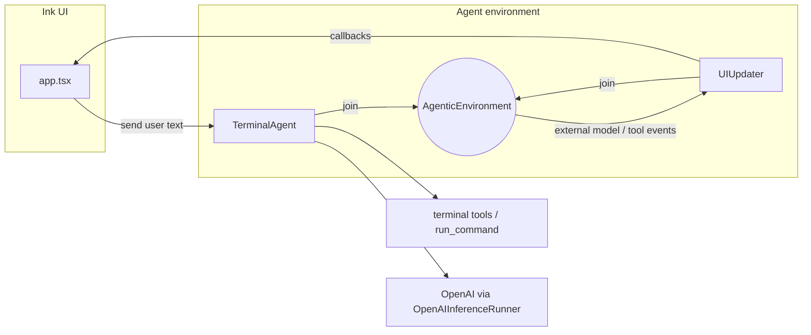

# CLI Agent Starter

A **starter template** for building **terminal CLI agents**: an [Ink](https://github.com/vadimdemedes/ink) chat UI wired to [**`@mozaik-ai/core`**](https://www.npmjs.com/package/@mozaik-ai/core), a TypeScript framework for **collaborative, event-driven agents**. Humans, agents, observers, and tools participate in one **`AgenticEnvironment`**; events fan out to subscribers without a central scheduler so you can compose reactive behaviors cleanly.

Fork or copy this repo, rename the package, add tools and participants, and ship your own agent-backed CLI.


---

## Use this template

This repository is meant to be **copied into a new project** so you keep a **clean git history**.

```bash
npx degit jigjoy-ai/cli-agent-starter my-cli-agent
cd my-cli-agent
git init
git add .
git commit -m "Initial commit"
npm install
```

Replace `jigjoy-ai/cli-agent-starter` with your fork or the published template URL if it moves. Replace `my-cli-agent` with your project folder name.

Then customize:

- Set **`name`** (and optionally **`bin`**) in [`package.json`](package.json).
- Adjust branding and copy in [`source/cli.tsx`](source/cli.tsx), [`source/app.tsx`](source/app.tsx), and this README.

### Alternative: GitHub “Use this template”

If you enable **Template repository** in the repo settings on GitHub, **Use this template** creates a new repository whose **first commit** is the template snapshot—also a straightforward way to start without inheriting long unrelated history.

---

## What this template includes

Built against **`@mozaik-ai/core` ^3.10.1** (see [`package.json`](package.json)).

| Concept                                                               | Where it lives                                                                                                   |
| --------------------------------------------------------------------- | ---------------------------------------------------------------------------------------------------------------- |
| **`AgenticEnvironment`** — shared bus for participants                | [`source/session.ts`](source/session.ts): `environment.start()` after `join()`                                   |
| **`BaseAgent`** — inference + tool execution                          | [`source/terminal/agent.ts`](source/terminal/agent.ts): `TerminalAgent`                                          |
| **`BaseObserver`** — model + tool events for UI (local / external)   | [`source/ui-updater.ts`](source/ui-updater.ts): `UIUpdater` (`onExternalModelMessage`, `onFunctionCall`, …)     |
| **`ModelContext`** + **`GenerativeModel`** (`Gpt54`)                  | [`source/session.ts`](source/session.ts)                                                                         |
| **`OpenAIInferenceRunner`** + **`DefaultFunctionCallRunner`**         | [`source/session.ts`](source/session.ts)                                                                         |
| Declarative **`Tool`** definitions                                    | [`source/terminal/tools.ts`](source/terminal/tools.ts)                                                           |

The Ink UI does **not** call OpenAI directly. It calls `session.send(message)`, which forwards to the agent; the **`UIUpdater`** observer listens for assistant text and tool notifications on the environment and updates the UI through callbacks.

---

## Architecture



**Flow in plain language**

1. **`createAgentSession`** wires `DefaultFunctionCallRunner` (tools), `OpenAIInferenceRunner`, `ModelContext`, `Gpt54`, `TerminalAgent`, `UIUpdater`, and **`BaseHuman`** (`user`), then starts the environment. User messages go through **`user.sendMessage(environment, message)`**.
2. **`TerminalAgent`** extends **`BaseAgent`**. On user input it injects a short developer instruction plus a **`UserMessageItem`**, then **`runInference`**. When the model emits a **`FunctionCallItem`**, it records it in context and **`executeFunctionCall`**; when outputs return and pending calls drain, it **`runInference`** again (typical agent loop).
3. **`UIUpdater`** extends **`BaseObserver`**. It overrides **`onExternalModelMessage`** to surface assistant text to Ink, and **`onFunctionCall` / `onExternalFunctionCall`** to show which tool was invoked.

---

## Prerequisites

- **Node.js** ≥ 16 (see [`package.json`](package.json) `engines`)
- **`@mozaik-ai/core` ^3.10.1** — upgrade or pin in [`package.json`](package.json) if you track a different minor
- **OpenAI API key** — the stack uses **`OpenAIInferenceRunner`** and **`Gpt54`** from `@mozaik-ai/core`

---

## Setup

1. Install dependencies:

   ```bash
   npm install
   ```

2. Configure credentials. Create a **`.env`** in the project directory (or a parent directory — the CLI searches upward from `cwd` and from the install location):

   ```env
   OPENAI_API_KEY=sk-...
   ```

3. Build TypeScript:

   ```bash
   npm run build
   ```

---

## Usage

Run the compiled CLI:

```bash
node dist/cli.js
```

Or link globally after a build (command matches the `"name"` field in `package.json`):

```bash
npm link
cli-agent
```

In the TUI: type a message and press **Enter**. Use **`/exit`**, **`/quit`**, **Escape**, or **Ctrl+C** to quit (Escape exits via Ink’s `useInput`).

When the model calls **`run_command`**, output is also printed to **`stdout`** from the tool implementation (see [`source/terminal/tools.ts`](source/terminal/tools.ts)), which is useful for debugging alongside the chat transcript.

---

## Project layout

| Path                                                                     | Role                                                 |
| ------------------------------------------------------------------------ | ---------------------------------------------------- |
| [`source/cli.tsx`](source/cli.tsx)                                       | Entry: `dotenv`, `meow` help, `render(<App />)`      |
| [`source/app.tsx`](source/app.tsx)                                       | Ink UI, local chat state, `createAgentSession` hooks |
| [`source/session.ts`](source/session.ts)                                 | Wiring: environment, human user, agent, observer, model |
| [`source/ui-updater.ts`](source/ui-updater.ts)                           | `BaseObserver` → UI callbacks                            |
| [`source/terminal/agent.ts`](source/terminal/agent.ts)                   | `BaseAgent`: context + inference loop                    |
| [`source/terminal/tools.ts`](source/terminal/tools.ts)                   | `Tool[]` for `run_command`                           |
| [`source/terminal/terminal.ts`](source/terminal/terminal.ts)             | `spawn`-based command runner                         |
| [`source/terminal/command-result.ts`](source/terminal/command-result.ts) | Structured command result type                       |

---

## Development

| Script                      | Command         |
| --------------------------- | --------------- |
| Build                       | `npm run build` |
| Watch mode                  | `npm run dev`   |
| Lint / format check / tests | `npm test`      |

---

## Learning more

- **Package:** [`@mozaik-ai/core` on npm](https://www.npmjs.com/package/@mozaik-ai/core) — this repo pins **`^3.10.1`**; install or upgrade with `npm install @mozaik-ai/core@^3.10.1`.
- The upstream README documents **`Participant`** handlers (`onMessage`, `onFunctionCall`, `onExternalModelMessage`, …), **`BaseHuman`**, **`BaseAgent`**, **`BaseObserver`**, and reactive agent patterns — this starter focuses on **one human + one agent + one observer** as a minimal base.

To extend your CLI: add another **`BaseAgent`** or **`BaseHuman`**, **`join`** it to the same **`AgenticEnvironment`**, and observe cross-agent traffic via **`onExternal*`** handlers.

---

## License

MIT — see [`package.json`](package.json).
